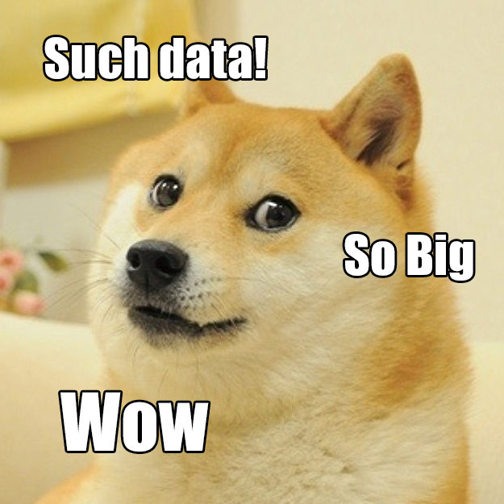

# GDH.jl
It is everything you need to handle your precious data.

The primary aim of this package is to make it easy to work with big data. What do I mean by *big* is the size of course. While training a deep neural network architecture, sometimes, it can be a headache to work with large image or video files. In the case of large image and video files, it is generally not possible to load data in an offline manner. 

This package provides a flexibility of the *online/offline* data loading option combined with a custom iterator which makes it very handy to feed data to neural network structure.

# What does it for?

As mentioned previously, the principal subject of this package is the huge image and video files. Due to the design choice of the data structures in this package, **it is highly recommended to keep seperate data files having different labels in different folders.** For example, the following data folder structure is the main employee of this package:

	.
	├── bar
	│   ├── 1.txt
	│   └── 2.txt
	└── foo
    	├── 1.txt
    	└── 2.txt

In this example, the *bar* and *foo* stands for the labels in the data, and all **.txt* files stands for the individual data points. 